# Substrate 基础概念
## 结构
### 环境分层
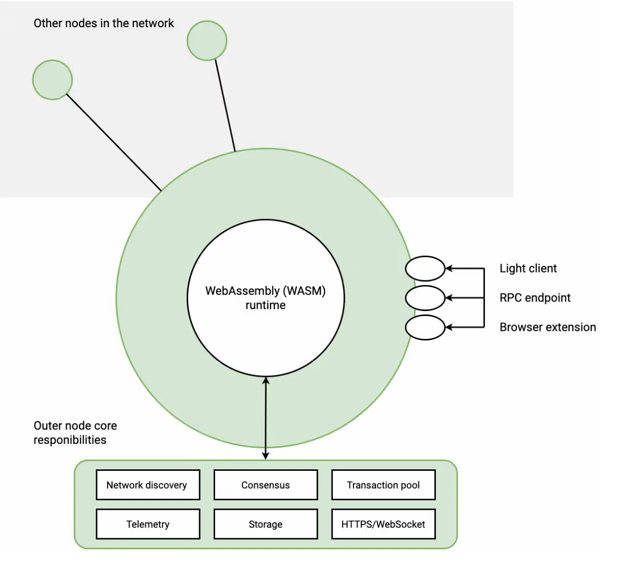  
**外部节点** 外部节点负责在runtime之外发生的活动。例如，外部节点负责处理对等点的发现、管理事务池、与其他节点通信以达成共识，以及应答来自外界的 RPC 调用或浏览器请求。  
**runtime** runtime确定交易是有效还是无效，并负责处理区块链状态转换功能的变化。  
外部节点使用了 多线程和[异步 Rust](https://rust-lang.github.io/async-book/01_getting_started/01_chapter.html)  
runtime编写使用了基本的[rust语法](https://rust-unofficial.github.io/patterns/idioms/index.html)和[no_std宏](https://docs.rust-embedded.org/book/intro/no-std.html)  

## 网络类型
基于基底的区块链可用于不同类型的网络架构， Substrate区块链用于构建以下4种网络类型：  

    1. 限制对一组受限节点的访问的专用网络。
    2. 实现自己的安全协议并且不与任何其他链连接或通信的单链。比特币和以太坊是非基于 Substrate 的单链的例子。
    3. 中继链为连接到它们的其他链提供分散的安全性和通信。Kusama 和 Polkadot 是中继链的例子。
    4. 为连接到中继链而构建的平行链，并能够与使用相同中继链的其他链进行通信。由于平行链依赖中继链来最终确定生成的区块，因此平行链必须实施与它们所针对的中继链相同的共识协议。

## 节点类型
### 全节点
全节点是区块链网络基础设施的关键部分，是最常见的节点类型。全节点存储区块链数据，并且通常参与常见的区块链操作，例如创作和验证区块、接收和验证交易以及响应用户请求提供数据。   
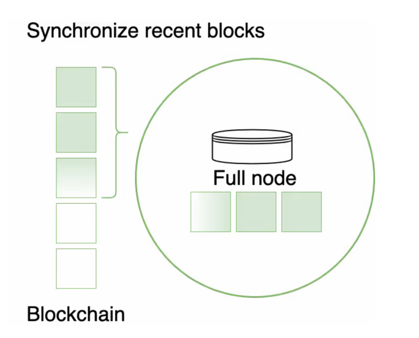  
全节点默认配置为仅存储**256**个块，更早的的块会被抛弃（创世块除外），且保留快数可配置。（以防止完整节点无限增长并消耗所有可用磁盘空间）  
由于全节点抛弃的只是块，保存的所有块头，所以还是可以验证状态和可以通过执行创世块中的所有块来重建整个区块链的状态  

### 存档节点
存档节点类似于完整节点，但是它存储了所有的块（完整状态）  
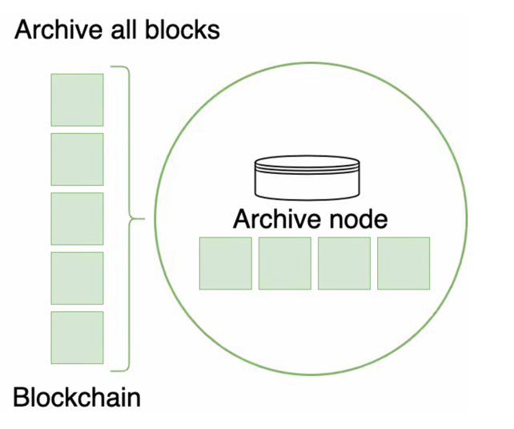  
**适用于**： 区块浏览器、钱包、论坛和类似应用程序
**缺点**： 需要大量磁盘空间
**优点**： 查找会更快、更高效

### 轻客户端节点
轻客户端节点使您能够以最低的硬件要求连接到 Substrate 网络。
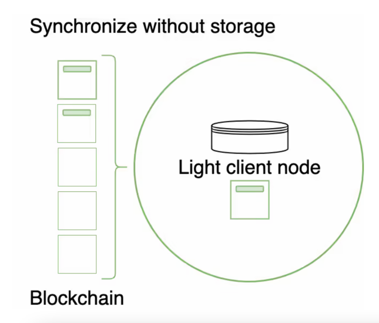  
轻客户端节点需要最少的系统资源，它们可以嵌入到基于 Web 的应用程序、浏览器扩展、移动设备应用程序或物联网 (IoT) 设备中  
轻客户端节点通过 RPC 端点提供runtime和对当前状态的访问，可以读取块头、提交交易和查看交易结果  
轻客户端节点不参与区块链或网络操作。例如，轻客户端节点不负责区块创作或验证、八卦交易或达成共识。轻客户端节点不存储任何过去的块，因此如果不从拥有它的节点请求历史数据，它就无法读取历史数据。  

## 节点角色
根据您在启动节点时指定的命令行选项，节点可以在链的进程中扮演不同的角色，并且可以提供对链上状态的不同级别的访问。  
可以做到但不限于以下限制：

    1. 您可以限制有权创作新区块的节点以及哪些节点可以与对等方通信
    2. 未被授权作为区块生产者的对等节点可以导入新区块、接收交易以及向其他节点发送和接收关于新交易的八卦
    3. 还可以阻止节点连接到更广泛的网络并限制与特定节点通信

## runtime开发
**状态转换** 区块链本质上都是链上发生的每次更改的分类账或记录，在 Substrate 的链中，这些状态更改会记录在runtime中，所以还被成为**提供状态转换函数**  
**runtime** 代表区块链状态的存储项和允许区块链用户更改此状态的事物的地方（确定哪些交易有效和无效，以及如何更改链状态以响应交易）  
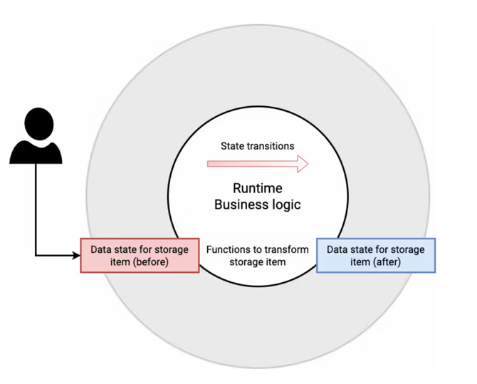  

### runtime接口
**runtime API** 促进了外部节点和runtime之间的这种通信  
**sp_api板条箱**提供了一个接口来实现runtime API。使用**impl_runtime_apis** 宏定义自己的自定义接口，但是每个runtime必须实现[Core](https://paritytech.github.io/substrate/master/sp_api/trait.Core.html "核心runtimeapi")和[Metadata](https://paritytech.github.io/substrate/master/sp_api/trait.Metadata.html "返回runtime元数据的元数据api特性")接口。  
除此之外还有以下runtime接口：  
[BlockBuilder](https://paritytech.github.io/substrate/master/sp_block_builder/trait.BlockBuilder.html "用于构建块所需的功能") 用于构建块所需的功能  
[TaggedTransactionQueue](https://paritytech.github.io/substrate/master/sp_transaction_pool/runtime_api/trait.TaggedTransactionQueue.html "用于验证交易") 用于验证交易  
[OffchainWorkerApi](https://paritytech.github.io/substrate/master/sp_offchain/trait.OffchainWorkerApi.html "用于启用链下操作") 用于启用链下操作  
[AuraApi](https://paritytech.github.io/substrate/master/sp_consensus_aura/trait.AuraApi.html "使用循环的共识方法进行块创作和验证") 使用循环的共识方法进行块创作和验证  
[SessionKeys](https://paritytech.github.io/substrate/master/sp_session/trait.SessionKeys.html "用于生成和解码会话密钥") 用于生成和解码会话密钥  
[GrandpaApi](https://paritytech.github.io/substrate/master/sp_finality_grandpa/trait.GrandpaApi.html "用于将Grandpa最终性小工具集成到runtime的API") 用于块最终确定到runtime(将Grandpa最终性小工具集成到runtime的API)  
[AccountNonceApi](https://paritytech.github.io/substrate/master/frame_system_rpc_runtime_api/trait.AccountNonceApi.html "查询账户随机数（又名交易索引）的API") 用于查询交易索引  
[TransactionPaymentApi](https://paritytech.github.io/substrate/master/pallet_transaction_payment_rpc_runtime_api/trait.TransactionPaymentApi.html "用于查询交易信息") 用于查询交易信息  
[Benchmark](https://paritytech.github.io/substrate/master/frame_benchmarking/trait.Benchmark.html "用于对框架runtime进行基准测试的runtimeapi") 用于估计和测量完成交易所需的执行时间  

### 核心原语
Substrate 还定义了runtime必须实现的核心原语，规定了必须向其他层提供什么的**最小的假设**  
**Hash** 一种对某些数据的加密摘要进行编码的类型。通常只是一个 256 位的数量。  
**DigestItem** 一种必须能够编码与共识和变更跟踪相关的许多“硬连线”替代方案之一以及与runtime中的特定模块相关的任意数量的“软编码”变体的类型  
**Digest** 一系列 DigestItems。这将编码与轻客户端相关的所有信息，以便在块内拥有。  
**Extrinsic** 表示区块链外部的单个数据的类型，被区块链识别。这通常涉及一个或多个签名，以及某种编码指令（例如，用于转移资金所有权或调用智能合约）。  
**Header** 代表与区块相关的所有信息的类型（加密或其他方式）。它包括父哈希、存储根和外部树根、摘要和块号。  
**Block** 本质上只是Header一系列Extrinsics 的组合，以及要使用的散列算法的规范。  
**BlockNumber** 一种对任何有效块具有的祖先总数进行编码的类型。通常为 32 位数量。  

### 框架
**FRAME**（Framework for Runtime Aggregation of Modularized Entities）是runtime开发人员可用的最强大的工具之一。它包含大量可简化runtime开发的模块和支持库，在 Substrate 中，这些模块（称为pallet）为您可能希望包含在runtime中的不同用例和功能提供可定制的业务逻辑  
除了pallet，FRAME 还通过以下库和模块提供与runtime交互的服务
[FRAME 系统 crateframe_system](https://paritytech.github.io/substrate/master/frame_system/index.html) 为runtime提供低级类型、存储和函数。   
[FRAME support crateframe_support](https://paritytech.github.io/substrate/master/frame_support/index.html) 是 Rust 宏、类型、特征和模块的集合，可简化 Substrate pallet的开发。  
[FRAME 执行palletframe_executive](https://paritytech.github.io/substrate/master/frame_executive/index.html) 在runtime协调对各个pallet的传入函数调用的执行。  
FRAME 及其系统、支持和执行模块如何为runtime环境提供服务  
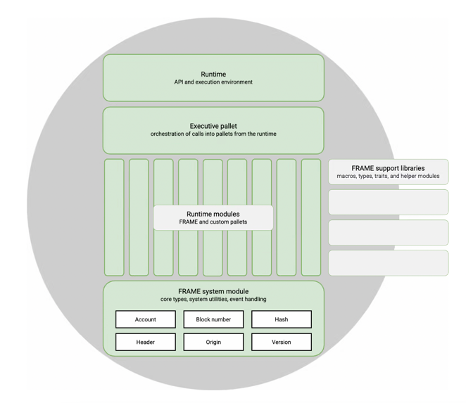  

### 使用pallet组成runtime
您可以在不使用 FRAME 的情况下构建基于 Substrate 的区块链。但是，FRAME pallet使您能够使用预定义的组件作为起点来编写自定义runtime逻辑。每个pallet都定义了特定的类型、存储项目和功能，以实现runtime的一组特定特性或功能。  
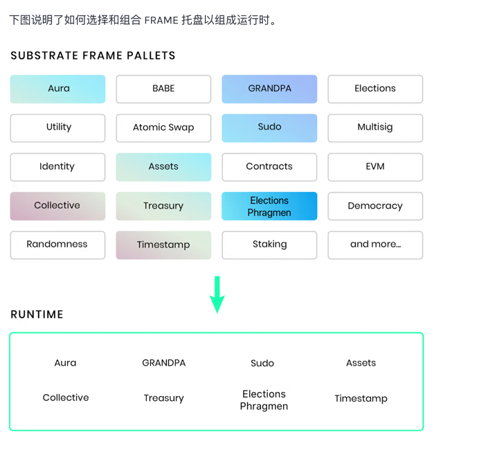  

### 构建定制pallet（pallet）
使用自定义pallet，您可以灵活地定义最适合您目的的runtime行为
大多数pallet由以下部分的某种组合组成：

    导入和依赖
    pallet类型声明
    runtime配置特征
    runtime存储
    runtime事件
    应在特定上下文中执行的逻辑挂钩
    可用于执行事务的函数调用

您可以根据需要将pallet与部分或全部部分组合在一起。当您开始设计和构建自定义runtime，您将了解更多关于 FRAME 库和用于定义配置特征、存储项、事件和错误的runtime原语，以及如何编写分派到runtime的函数调用执行。  
例如，如果您想定义一个自定义pallet，您可以从pallet的骨架结构开始，类似于以下内容：
````
// Add required imports and dependencies (添加所需的导入和依赖项)
pub use pallet::*;
#[frame_support::pallet]
pub mod pallet {
 use frame_support::pallet_prelude::*;
 use frame_system::pallet_prelude::*;

 // Declare the pallet type (声明pallet类型)
 // This is a placeholder to implement traits and methods. (这是实现特征和方法的占位符。)
    #[pallet::pallet]
    #[pallet::generate_store(pub(super) trait Store)]
    pub struct Pallet<T>(_);

 // Add the runtime configuration trait (添加runtime配置特性)
 // All types and constants go here. (所有类型和常量都在这里。)
 #[pallet::config]
 pub trait Config: frame_system::Config { ... }

 // Add runtime storage to declare storage items. (添加runtime存储以声明存储项。)
 #[pallet::storage]
 #[pallet::getter(fn something)]
 pub type MyStorage<T: Config> = StorageValue<_, u32>;

 // Add runtime events (添加runtime事件)
 #[pallet::event]
 #[pallet::generate_deposit(pub(super) fn deposit_event)]
 pub enum Event<T: Config> { ... }

 //  Add hooks to define some logic that should be executed (添加钩子来定义应该执行的一些逻辑)
 //  in a specific context, for example on_initialize. (在特定上下文中，例如on_initialize。)
 #[pallet::hooks]
 impl<T: Config> Hooks<BlockNumberFor<T>> for Pallet<T> { ... }

 // Add functions that are callable from outside the runtime. (添加可从runtime外部调用的函数。)
 #[pallet::call]
 impl<T:Config> Pallet<T> { ... }

}
````

## 共识 （node-template默认的共识模型Aura+GRANDPA）
### 阶段
**块创作**是节点用于创建新块的过程  
**区块终结**用于处理分叉和选择区块链的过程（区块终结是一种解决分叉的机制）

### 块创作
通过共识模型去决定哪个节点有创建权限。每个去苦熬高度必有一个区块作者
Substrate链的区块创作算法有：

    基于权限的循环调度(Aura：基于插槽的块创作机制，可以创建区块的验证者以循环方式轮换)
    盲分配区块链扩展（BABE）基于槽的调度（验证者是基于可验证随机函数 (VRF) 选择的，权益证明区块链。每个验证者都被分配了一个epoch 的权重。 这个 epoch 被分成多个槽，验证器在每个槽评估它的 VRF。对于验证者的 VRF 输出低于其权重的每个槽，允许创建一个块）
        *Substrate 对 BABE 的实现也有一个备用机制，用于在给定插槽中未选择任何权限时。这些辅助槽分配允许 BABE 实现恒定的出块时间。*
    基于工作量证明计算的调度（不是基于槽的，并且不需要已知的权限集。只要能解决计算上具有挑战性的问题（通常是哈希原像搜索）就可以出块）

Aura 和 BABE 共识模型要求您拥有一组已知的允许生成块的验证器节点  
在工作量证明共识模型中，如果节点解决了计算密集型问题，任何节点都可以随时生成一个块。解决该问题需要 CPU 时间，因此节点只能按其计算资源的比例生成块。Substrate 提供了一个工作量证明区块生产引擎。  

### 完成和分叉（BABE > Aura）
分叉选择规则是一种算法，它选择应该扩展的最佳链。Substrate 通过[SelectChain](https://github.com/w3f/consensus/blob/master/pdf/grandpa.pdf) trait 暴露了这个分叉选择规则。你可以使用 trait 来编写你的自定义分叉选择规则，或者使用GRANDPA，Polkadot 和类似链中使用的最终机制。  
**GRANDPA**(默认)协议，最长链规则简单地说最好的链就是最长的链。根据[LongestChain](https://paritytech.github.io/substrate/master/sc_consensus/struct.LongestChain.html)规则选择。GRANDPA 在其投票机制中使用最长链规则。  
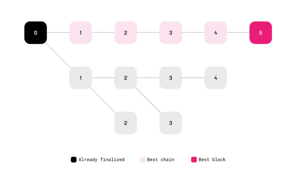  

**GHOST**(Greedy Heaviest Observed SubTree )从创世区块开始，每个分叉都是通过递归选择构建在其上的区块最多的分支来解决的。  
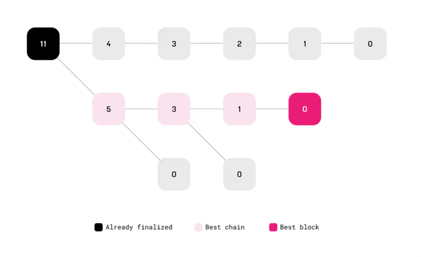  

### 确定性终结（没明白）
用户很自然地想知道交易何时完成并由某些事件发出信号，例如交付收据或签署文件。然而，根据迄今为止描述的块创作和分叉选择规则，交易永远不会完全完成。更长或更重的链总是有可能恢复交易。但是，在特定块之上构建的块越多，它被还原的可能性就越小。通过这种方式，块创作以及适当的分叉选择规则提供了概率确定性。

如果您的区块链需要确定性的确定性，您可以在区块链逻辑中添加确定性机制。例如，您可以让固定权限集的成员投票。当某个区块获得足够多的选票时，该区块被视为最终区块。在大多数区块链中，这个阈值是三分之二。如果没有外部协调（例如硬分叉），则无法恢复已完成的块。

在某些共识模型中，区块生产和区块最终确定性是结合在一起的，在N+1区块最终确定之前无法创作新区块N。如您所见，在 Substrate 中，这两个进程是相互隔离的。通过将区块创作与区块最终化分开，Substrate 使您能够使用任何具有概率最终性的区块创作算法或将其与最终性机制结合以实现确定性最终性。

如果您的区块链使用确定性机制，您必须修改分叉选择规则以考虑确定性投票的结果。例如，节点不会采用最长的链周期，而是采用包含最近完成的区块的最长链。  

所有确定性终结性算法，包括 GRANDPA，都至少需要2f + 1非故障节点，其中f是故障或恶意节点的数量  
并非所有共识协议都定义一个单一的规范链。当具有相同父级的两个块没有冲突的状态更改时，一些协议会验证有向无环图(DAG)  

## 区块基础
在 Substrate 中，一个块由一个标头和一个交易数组组成  
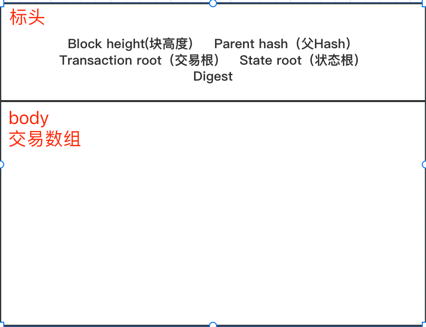
交易根是本系列的加密摘要。此加密摘要有两个目的：

    它可以防止在构建和分发标头之后对一系列事务进行任何更改。
    它使轻客户端能够简洁地验证任何给定的交易是否存在于仅给定头信息的块中。

## 交易
### 交易类型
交易提供了一种机制来更改可以包含在块中的状态。Substrate 中有三种不同的事务类型（外部事务，外部通常用于表示源自runtime之外的任何信息）：  
#### 签署的交易（最常见）
顾名思义，就是必须对入站请求进行签名，通常，使用提交请求的帐户的私钥对请求进行签名。大多数情况下提交请求的账户会支付费用
    
    例如，假设您有一个带有一定数量令牌的帐户。如果您想将代币转移给 Alice，您可以调用pallet_balances::Call::transfer余额pallet中的函数。因为您的帐户用于进行此调用，所以您的帐户密钥用于签署交易。作为请求者，您通常负责支付费用以处理您的请求。或者，您还可以提示区块作者以赋予您的交易更高的优先级。

#### 未签名的交易
不需要签名的交易
**坏处**：没有经济上的威慑力来防止垃圾邮件或重放攻击
需要更谨慎的定义验证未签名交易的条件。
    
    pallet_im_online::Call::heartbeat函数使用未签名的交易来使验证节点能够向网络发送信号以指示节点在线。此函数只能由在网络中注册为验证者的节点调用。该函数包括验证节点是否为验证者的内部逻辑，允许节点使用未签名的交易调用该函数以避免支付任何费用。

#### 固有交易
一种特殊类型的未签名交易，区块创作节点可以直接将信息添加到区块中。固有交易只能由调用它们的块创作节点插入到块中  

    例如，如果区块创作节点将时间戳插入区块，则无法证明时间戳是准确的。相反，验证者可能会根据时间戳是否在他们自己的系统时钟的某个可接受范围内来接受或拒绝该块。
    pallet_timestamp::Call::now函数使块创作节点能够在节点生成的每个块中插入当前时间戳
    paras_inherent::Call::enter函数使平行链收集者节点能够向其中继链发送中继链期望的验证数据

### 交易生命周期
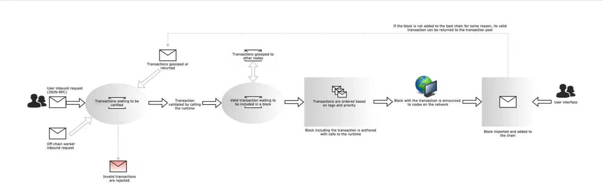  
1. 本地节点侦听网络上的事务。
2. 每笔交易都经过验证。
3. 有效的交易被放置在交易池中。
4. 交易池在适当的交易队列中对有效交易进行排序，执行模块调用runtime开始下一个块。
5. 执行事务并将状态更改存储在本地内存中。
6. 构建的块发布到网络。

根据网络配置，被授权创作区块的节点和未被授权创作区块的节点。任何发送到非创作节点的签名或未签名交易都会被传递到网络中的其他节点并进入他们的交易池，直到被创作节点接收。  

### 验证和排队
为了达成共识，交易会在本地节点的交易池中进行校验和排队  
根据runtime中定义的规则，交易池会检查每个交易的有限性。检查通过后的有效交易会进行排队。交易池也会定期检查交易是否仍然有效，无效/过期的交易会从池中剔除。  

    交易索引（也称为交易随机数）是否正确？
    用于签署交易的账户是否有足够的资金支付相关费用？
    用于签署交易的签名是否有效？

**交易池**只处理交易的有效性和放置在交易队列中的有效交易的排序。有关验证机制如何工作的具体细节——包括处理费用、账户或签名——可以在该[validate_transaction](https://paritytech.github.io/substrate/master/sp_transaction_pool/runtime_api/trait.TaggedTransactionQueue.html#method.validate_transaction)方法中找到。  
**交易队列** 有效的交易将被交易池移交到交易队列中，交易队列分为两种：
1. **就绪队列** 存放新待处理块中的交易。如果runtime是使用 FRAME 构建的，则事务必须遵循它们放置在就绪队列中的确切顺序。
2. **未来队列** 存放将来可能变得有效的交易。
   1. 例如，如果一个交易nonce的账户对其账户来说太高，它可以在未来队列中等待，直到该账户的适当数量的交易被包含在链中。

**无效交易**  

    该交易已包含在一个块中，因此它已从验证队列中删除。
    交易的签名无效，因此立即被拒绝。
    交易太大而无法放入当前区块，因此将其放回队列中以进行新一轮验证。

**基于优先级的交易排序**
交易从高优先级到低优先级排序，直到块达到最大权重或长度。
交易优先级在runtime中计算，并作为交易上的标签提供给外部节点。在 FRAME runtime中有一个特殊的pallet用于根据与交易相关的权重和费用计算优先级。该pallet适用于除了固有交易外所有类型的交易。固有交易使用EnsureInherentsAreFirst trait 放置  
**基于账户的交易排序**
基于FRAME构建的runtime，每个签名交易会包含一个随机数，每次特定的账户交易该随机数（nonce：类似于mysql的id自增）会增加。区块创作节点可以在对交易进行排序以包含在区块中时使用随机数。  
对于具有依赖关系的交易，排序会考虑交易支付的费用以及对其包含的其他交易的任何依赖关系。例如：
    
    如果有一个未签名的交易TransactionPriority::max_value()和另一个签名的交易，则未签名的交易首先放入队列中。
    如果有两个交易来自不同的发送者，则priority（优先级）确定哪个交易更重要，应该首先包含在块中。
    如果来自同一发送者的两笔交易具有相同的nonce: 只有一笔交易可以包含在区块中，因此只有费用较高的交易会被包含在队列中。

### 执行交易
Substrate会有一个单独的**执行模块**，去执行排队好的交易。执行模块调用runtime中的中的函数按照特定的顺序执行这些函数。  
**开发人员** 必须知道执行模块如何与系统pallet以及构成区块链业务逻辑的其他pallet交互。产生块的顺序：  
1. **初始化一个块**
   1. system pallet 的 **on_initialize** 最先被调用，然后调用 other runtime pallets。**on_initialize**功能使您能够定义应在执行事务之前完成的业务逻辑。其他pallets按照它们在construct_runtime!宏中定义的顺序被调用。  
   2. 执行完所有on_initialize功能后，执行模块检查区块头中的父哈希和树根，以验证信息是否正确。
2. **执行交易**
   1. 状态在执行之前不会被缓存
   2. 状态更改在执行期间直接写入存储
   3. 交易在执行过程中失败，那么在失败之前发生的任何状态更改都不会被恢复，从而使块处于不可恢复的状态。在将任何状态更改提交到存储之前，runtime逻辑应执行所有必要的检查以确保外部操作成功
   4. event也写入存储。因此，runtime逻辑不应在执行补充操作之前发出事件。如果在发出事件后事务失败，则不会恢复该事件
3. **完成一个块**
   1. 执行完所有交易后，**执行模块**会调用每个pallet的**on_idle**和**on_finalize**函数，以执行在块末尾发生的最终业务。
   2. **construct_runtime! 宏**模块按照宏中定义的顺序再次执行，但在这种情况下，on_finalize系统pallet中的功能最后执行。
   3. 执行完所有on_finalize后，执行模块检查块头中的摘要和存储根是否与初始化块时计算的内容相匹配
   4. 该on_idle函数还通过块的剩余权重，以允许根据区块链的使用情况执行（暂时不明白）

### 阻止创作和阻止导入
生产好的区块发布到网络后，可供其他几点导入。块导入队列是Substrate 节点的外部节点的一部分。块导入队列侦听传入的块和与共识相关的消息，并将它们添加到池中。在池中，检查传入信息的有效性，如果无效则丢弃。在验证区块或消息有效后，区块导入队列将传入的信息导入本地节点的状态，并将其添加到节点知道的区块数据库中。  
自定义共识逻辑或想了解更多关于块导入队列的实现：  
[ImportQueue](https://paritytech.github.io/substrate/master/sc_consensus/import_queue/trait.ImportQueue.html)  
[Link](https://paritytech.github.io/substrate/master/sc_consensus/import_queue/trait.Link.html)  
[BasicQueue](https://paritytech.github.io/substrate/master/sc_consensus/import_queue/struct.BasicQueue.html)  
[Verifier](https://paritytech.github.io/substrate/master/sc_consensus/import_queue/trait.Verifier.html)  
[BlockImport](https://paritytech.github.io/substrate/master/sc_consensus/block_import/trait.BlockImport.html)  

## 存储
Substrate 使用一个简单的键值对数据存储，实现为数据库支持的修改后的 Merkle 树
### 键值数据库
**RocksDB**是一种用于快速存储环境的持久键值存储。并且支持实验性质的ParityDb（是针对区块链应用程序优化的嵌入式持久键值存储）  
Substrate clients，Substrate light-clients， Off-chain workers等需要持久存储的组件都用到了DB。

### trie结构（Base-16 Modified Merkle Patricia）针对于链的结构
[paritytech/trie](https://github.com/paritytech/trie)提供trie 结构，其内容可以修改，并且其根哈希可以有效地重新计算。  
trie 根是 trie 中数据的表示；也就是说，具有不同数据的两次尝试将始终具有不同的根。因此两个区块链节点可以通过简单地比较它们的 trie 根来轻松验证它们是否具有相同的状态。  
访问 trie 数据的成本很高（就是访问链的数据成本高）。每个读取操作需要 O(log N) 时间，其中 N 是存储在 trie 中的元素数。  
所有的 trie 节点都存储在数据库中，部分 trie 状态可以被修剪，即当键值对超出非归档节点的修剪范围时，可以从存储中删除，出于性能原因，我们不使用引用计数。  

#### State trie
基于 Substrate 的链有一个主树，称为状态树，其根哈希放置在每个块头中。这用于轻松验证区块链的状态，并为轻客户端验证证明提供依据。  
这个 trie 只存储规范链的内容，而不是分叉。有一个单独的[state_db层](https://paritytech.github.io/substrate/master/sc_state_db/index.html)维护 trie 状态，所有非规范的引用都计入内存。  

#### Child trie
Child trie由 State trie生成，并且包含 State trie的根哈希，在runtime中使用。  
Child trie 和 State trie是相同的，只是Child trie的根被存储和更新为State trie 的节点而不是块头。由于trie的结构特性，所以包含Child trie的State trie也很容易验证完整节点的状态。  
用途：independent trie有一个单独的根哈希，您可以使用它来验证该 trie 中的特定内容。

### 查询存储
Substrate 提供了RPC远程调用的服务器来查询runtime的存储，只需提供key。
**Storage value keys**
要获取存储值的键，要获取包含该存储值的pallets的名称的TwoX 128 散列，并将存储值本身名称的 TwoX 128 散列附加到它上面  
例如，Sudopallet公开了一个名为的存储值项Key：
````
twox_128("Sudo")                   = "0x5c0d1176a568c1f92944340dbfed9e9c"
twox_128("Key")                    = "0x530ebca703c85910e7164cb7d1c9e47b"
twox_128("Sudo") + twox_128("Key") = "0x5c0d1176a568c1f92944340dbfed9e9c530ebca703c85910e7164cb7d1c9e47b"

state_getStorage("0x5c0d1176a568c1f92944340dbfed9e9c530ebca703c85910e7164cb7d1c9e47b") = "0xd43593c715fdd31c61141abd04a99fd6822c8558854ccde39a5684e7a56da27d"

"0xd43593c715fdd31c61141abd04a99fd6822c8558854ccde39a5684e7a56da27d" SCALE-encoded后就是Alice's account ID (5GrwvaEF5zXb26Fz9rcQpDWS57CtERHpNehXCPcNoHGKutQY)
````

**Storage map keys**
要从映射中检索元素，请将所需映射键的哈希附加到存储映射的存储键。对于具有两个键的映射（Storage Double Maps），将第一个映射键的哈希和第二个映射键的哈希附加到 Storage Double Map 的存储键。  
和Storage value keys一样，pallets的名称的TwoX 128 散列 + 存储值本身名称的 TwoX 128 散列 + 所需映射键的哈希（使用正确的散列算法（在#[pallet::storage](https://docs.substrate.io/build/runtime-storage/#declaring-storage-items)宏中声明的算法）  
这是一个示例，说明查询从以帐户余额命名FreeBalance的pallet命名的存储映射:  
````
在本例中，Map键值使用Blake2 128 Concat 散列算法  Balances Alice FreeBalance

twox_128("Balances")                                             = "0xc2261276cc9d1f8598ea4b6a74b15c2f"
twox_128("FreeBalance")                                          = "0x6482b9ade7bc6657aaca787ba1add3b4"
scale_encode("5GrwvaEF5zXb26Fz9rcQpDWS57CtERHpNehXCPcNoHGKutQY") = "0xd43593c715fdd31c61141abd04a99fd6822c8558854ccde39a5684e7a56da27d"

blake2_128_concat("0xd43593c715fdd31c61141abd04a99fd6822c8558854ccde39a5684e7a56da27d") = "0xde1e86a9a8c739864cf3cc5ec2bea59fd43593c715fdd31c61141abd04a99fd6822c8558854ccde39a5684e7a56da27d"

state_getStorage("0xc2261276cc9d1f8598ea4b6a74b15c2f6482b9ade7bc6657aaca787ba1add3b4de1e86a9a8c739864cf3cc5ec2bea59fd43593c715fdd31c61141abd04a99fd6822c8558854ccde39a5684e7a56da27d") = "0x0000a0dec5adc9353600000000000000"

0x0000a0dec5adc9353600000000000000 SCALE解码后就是Alice的余额1000000000000000000000
````
上面是一个精确的查找，但是我门也可能用到非精确的查找，比如 Substrate RPC 通过state_getKeysRPC 端点查询存储映射的键列表 :  
````
twox_128("Balances")                                      = "0xc2261276cc9d1f8598ea4b6a74b15c2f"
twox_128("FreeBalance")                                   = "0x6482b9ade7bc6657aaca787ba1add3b4"

state_getKeys("0xc2261276cc9d1f8598ea4b6a74b15c2f6482b9ade7bc6657aaca787ba1add3b4") = [
 "0xc2261276cc9d1f8598ea4b6a74b15c2f6482b9ade7bc6657aaca787ba1add3b4de1e86a9a8c739864cf3cc5ec2bea59fd43593c715fdd31c61141abd04a99fd6822c8558854ccde39a5684e7a56da27d",
 "0xc2261276cc9d1f8598ea4b6a74b15c2f6482b9ade7bc6657aaca787ba1add3b432a5935f6edc617ae178fef9eb1e211fbe5ddb1579b72e84524fc29e78609e3caf42e85aa118ebfe0b0ad404b5bdd25f",
 ...
]

Substrate RPC 端点返回的列表中的每个元素state_getKeys都可以直接用作 RPCstate_getStorage端点的输入。
````
### Runtime storage API
[FRAME Support crate](https://paritytech.github.io/substrate/master/frame_support/index.html)提供了用于为runtime的存储项生成唯一的、确定性的密钥的实用程序。这些存储项放置在state trie 中，可以通过 key 查询树来访问。  

## 帐户、地址和密钥
账户一般分为三大类：  
1. 使最终用户能够与区块链交互的用户帐户
2. 通过限制一些质押和治理操作，为验证者和提名者提供额外安全性的网络账户
3. 由**有效来源**执行以执行特定于pallet的操作的pallet帐户
### 公钥和私钥
每个账户都有一个拥有公钥和私钥对的所有者。私钥是随机生成的数字的密码安全序列。私钥生成一个随机的单词序列，称为秘密种子短语或助记符。如果私钥丢失，帐户所有者可以使用此秘密种子短语来恢复对帐户的访问。  
公钥是该帐户在网络上的标识方式，并用作交易的目标地址。  
### 地址编码和链特定地址
Substrate 使您能够使用单个公钥来派生多个地址，因此您可以与多个链进行交互。默认情况下，与帐户的公钥关联的地址使用 Substrate SS58 地址格式。此地址格式基于base-58 编码。  
base-58 编码还有以下好处：

    编码地址由 58 个字母数字字符组成。
    字母数字字符串省略了字符串中难以相互区分的字符，例如0、O、I和。l
    网络信息（例如，特定于网络的前缀）可以编码在地址中。
    可以使用校验和检测输入错误，以确保正确输入地址。

不同的Substrate链可以创建不同的前缀的地址类型：
1. Polkadot 地址1都以大写字母开头
2. 所有 Kusama 地址都以大写字母开头
3. 所有未注册的 Substrate 链都以5

### FRAME中的账户信息
FRAME构建的runtime中，账户被定义为一个存储映射，带有一个32字节的地址标识符和对应的账户信息。

### 专门的账户
平时说的账户是用来控制资金和交易的公钥/私钥对。但 Substrate 支持一些专门的账户来控制如何使用特定的密钥对。例如：
1. stash account。为验证者定义质押余额的公钥/私钥对的账户。该账户的密钥处于离线状态
2. controller account。代表公钥/私钥对，表明您的验证或提名意图，设置奖励目的地等偏好，对于验证者，设置会话密钥
3. Session account。验证者用来签署共识相关消息的公钥/私钥对。
   1. 创建会话帐户密钥对，您必须通过使用您的控制器密钥签署交易并在链上发布会话证书来证明该帐户代表您的存储帐户和提名人
   2. 使用[session.setKeys](https://paritytech.github.io/substrate/master/pallet_session/pallet/struct.Pallet.html#method.set_keys)在链上注册新的会话密钥
   3. 使用RPC 调用[author_rotateKeys](https://paritytech.github.io/substrate/master/sc_rpc/author/trait.AuthorApiClient.html#tymethod.rotate_keys)更改会话密钥
4. Keyless proxy accounts(无密钥代理帐户) 在某些情况下，您可能希望创建一个与任何所有者分离的帐户，以便它可以用于执行自主交易
   1. 使用proxy pallet创建，该帐户有权使用委派帐户作为签名源来调度某些类型的呼叫。

## 编写规范
由于在构建 Substrate 节点时，我们使用wasm32-unknown-unknown编译目标，这意味着 Substrate runtime工程师受限于编写必须编译为 Wasm 的runtime。这意味着您不能依赖一些典型的标准库类型和函数，而只能no_std对大多数runtime代码使用兼容的 crate  

## OffChain operations
您可能希望在更新链上状态之前在不使用链上资源的情况下从链下源查询数据或处理数据。合并链下数据的传统方式涉及连接到预言机以提供来自某些传统来源的数据。尽管使用预言机是处理链下数据源的一种方法，但预言机可以提供的安全性、可扩展性和基础设施效率存在限制。  
为了使链下数据集成更加安全和高效，Substrate 通过以下功能支持链下操作：  
1. Offchain workers (链下工作机) 一个组件子系统，可以执行长时间运行且可能不确定的任务
2. Offchain storage （链下存储） Substrate 节点本地的存储，可以由offchain workers（读写访问权限）和on-chain logic（写访问权限）访问
3. Offchain indexing（链下索引）链下索引是可选服务，用来让on-chain logic可以直接写入链下存储，以提供临时存储

### Offchain workers
链下工作机有自己的wasm环境，分离的环境保证了不会影响链出块 （网站服务请求/数据的加密、解密和签名/随机数生成/CPU密集型计算/计算时间大于出块时间的任务）都适合在链下工作机执行  
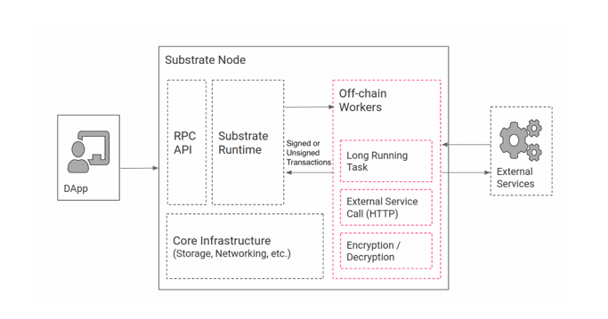  
1. 能够向链提交交易（无论是签名的还是未签名的）以发布计算结果
2. 允许工作人员从外部服务访问和获取数据（是一个功能齐全的http客户端）
3. 访问本地密钥库以签署和验证语句或交易
4. 在所有链下工作人员之间共享的附加本地键值数据库
5. 用于随机数生成的安全本地熵源
6. 访问节点的精确本地时间
7. 睡眠和恢复工作的能力

**注意**链下工作机的执行结构不受链上常规的交易验证的约束，所以需要自己写一个验证以保证安全。 在每个区块导入期间都会产生链下工作人员  

### Offchain storage
存在于节点本地，且不与其他节点共享，也不共享。  
链下存储充当了链下工作线程相互通信以及链下和链上逻辑之间通信的桥梁。它也可以使用远程过程调用 (RPC) 读取  

### Offchain indexing
可以理解为一个工具，一部分是让runtime可以直接写入数据（没处理一个块，链下存储都会把数据写入，以达到可以访问历史数据的需求）  
使用 ```--enable-offchain-indexing``` 来开启链下存储
