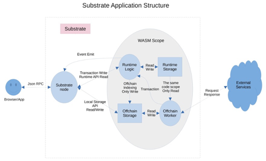
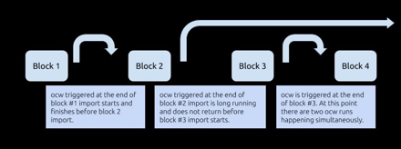

# off-chain-work

## Substrate OffChain Worker 的优势
1. 集成度更高，链上链下代码统一管理，在一个节点内，从而维护性更好；
2. 链下代码经过共识验证，保证分发的可靠性，保证大家执行的是同一份代码，防止潜在的作恶行为；
3. 链下代码的可升级性。与Substrate链上代码共享同一份forkless升级策略；
4. 从offChain Worker向链上发交易，不走对外的rpc通道，这样能实现更灵活更高效的交易处理；

## 三大组件
1. offChain Worker  
2. offChain Storage  
3. offChain Indexing  
在[基础知识](./Basic_concept_study.md)中有详细介绍

## OffChain Worker 架构
  
以上模式必须在三大组件都在的情况下才可以 [详情](https://mp.weixin.qq.com/s/tyTdn1CM7iVE90UDRRv0JQ)  
区块链应用开发更加复杂一些，因为涉及到链上链下不同部分的操作。对上图 Substrate Application Structure 的解释如下：  
1. 外界使用 Json RPC 与 substrate node 进行交互
2. （几乎）所有对链上状态的修改，都应该使用 transaction 提到到 Runtime logic 中进行处理
3. Runtime logic 对 Runtime 的 Storage 具有完全的读写能力。对 Offchain Storage 具有写能力
4. Substrate node 能直接对 Offchain Storage 进行读写
5. Offchain Workers 能直接对 Offchain Storage 进行读写，只能读 Runtime Storage 中的东西
6. Offchain Worker 可以提交新的交易来实现对链上状态的更新
7. Offchain Worker 可以请求外部服务，获取相应的数据回来，（异步）更新链上状态或者本地存储
8. Substrate node 可以通过 Runtime API 机制对链上状态进行读取，也可以传参数进 Runtime logic 以更灵活地读状态
9. 链上状态的变更，会生成 event，发送到 substrate node 中，经由 rpc 被外界监听到  

**权限问题**：  
1. Offchain Worker可以直接读链上的数据（状态），但不能写
2. 链上代码可以向 Offchain Storage中写数据，但不能读
3. 外层 node 和 rpc 可以直接读链上存储的数据，和Offchain Storage中存储的数据
4. 外层 node 和 rpc 可以直接向 Offchain Storage 中写数据，但不能直接向链上存储写数据（必须通过发交易更改链上状态）

基于 Substrate 这种清晰的结构，我们可以设计一些不同的 Web3.0 应用的编程范式。比如其中一种是：  
1. 所有修改状态的操作，都提交到链上处理。但是链上不一定存储所有信息，可以通过 Offchain Indexing 存一部分到 local storage (offchain storage)
2. 所有查询状态的操作，可以只通过 local storage 查询 。或者链下与链上 storage 相结合的方式查询（链上存储代价较大，而链下存储代价小）。
3. Offchain 层可以作为与外界服务完全隔离的缓存层。使得链上逻辑，只需要专注于 substrate 体系本身。而不受外部接口和数据的影响

还可能出现一些疯狂的玩法，比如：  
 ● 直接使用 substrate node 和 offchain storage, offchain worker 部分，实现一个传统的应用服务。完全跟区块链没有关系  
 ● 所有交易先提交到 offchain storage 中，由 offchain worker 监听后，来代理提交交易？：P  

## OffChain Worker 功能 (仅链下使用)
1. 能够将已签名或未签名的事务提交到链以发布计算结果。
2. 一个功能齐全的HTTP客户端，允许工作者从外部服务访问和获取数据。
3. 访问本地密钥库以签署和验证语句或事务。
4. 一个额外的本地键值数据库，在所有链外工作人员之间共享。
5. 用于生成随机数的安全的局部熵源。
6. 访问节点的精确本地时间。
7. 睡眠和恢复工作的能力。

### 怎么实现 OffChain Worker
[示例1](https://github.com/miketang84/oneblockplus_offchain_lesson/tree/main/substrate-node-template-1)  
1. 给 pallet-template添加 offchain worker hook
2. 在offchain worker中打印信息，观察日志出现的时机

### OffChain Worker 生命周期
[示例2](https://github.com/miketang84/oneblockplus_offchain_lesson/tree/main/substrate-node-template-2)  
1. 同时打开多个hooks，on_initialize, on_finalize, on_idle
2. 在各个hooks中打印信息，观察日志出现的时机，理解 offchain worker 的执行时机

[示例3](https://github.com/miketang84/oneblockplus_offchain_lesson/tree/main/substrate-node-template-3)  
1. 在offchain worker中sleep一段时间，观察offchain worker的跨块执行效果 
  

### OffChain Worker 编程模式
定时器流模式（定时重入）与 响应式 Reaction 模式的区别，需要注意编程模式上的变化  

### 使用 Local Storage 存储
Local Storage的几个作用：  
1. Offchain Worker 可直接读写Local Storage
2. 链上代码可通过 Indexing 功能直接向Local Storage写入数据，但是不能读
3. 可用于Offchain Worker tasks之间的通信和协调，注意由于可能同时存在多个Offchain worker，因此可能对存储的访问需要lock

[示例4](https://github.com/miketang84/oneblockplus_offchain_lesson/tree/main/substrate-node-template-4)  
1. 设计为在奇数块向 Local Storage 写数据，偶数块读取数据，并检查 
2. 如何获取链下随机数，如何对BlockNumer类型进行数学运算，如何获取链下时间，如何生成存储key，如何写链下存储，如何读链下存储，如何清理存储key

[示例5](https://github.com/miketang84/oneblockplus_offchain_lesson/tree/main/substrate-node-template-5)  
1. 在示例4的基础上，使用mutate方法对数据进行原子更改
2. 可以学到：新的原子操作修改方法（不再使用之前手动锁的方式），学习配套的错误处理模式

## 获取外部 Http 接口 Json 数据
[示例6](https://github.com/miketang84/oneblockplus_offchain_lesson/tree/main/substrate-node-template-6)  
1. 学会在Offchain Worker中发起https请求，获取数据（boilerplate）
2. 学习如何使用serde_json解析获取到的json数据
3. 学习serde的类型转换和调试相关知识

## 在Offchain Worker中，向链上发起签名交易
[示例7](https://github.com/miketang84/oneblockplus_offchain_lesson/tree/main/substrate-node-template-7)  
1. Node, runtime, pallet中都需要改，地方有点多 
2. 大部分都是boilerplate代码，非常固定，不需要理解每个地方。重点要理解原理和整个流程
3. 签名交易，需要有账户给它签名。交易的执行会向这个账户收 tx fee
4. 本示例提供了能运行的最小化实例，没有多余的代码干扰
5. 多查阅 https://crates.parity.io/sc_service/index.html

## 在Offchain Worker中，向链上发起不签名交易
[示例8](https://github.com/miketang84/oneblockplus_offchain_lesson/tree/main/substrate-node-template-8)  
1. 要改runtime和pallet，比签名交易代码要少一些
2. 大部分都是boilerplate代码，非常固定。重点要理解原理和整个流程
3. 不签名交易，无 tx fee，因为找不到人收费
4. #[pallet::validate_unsigned], TransactionValidity, ValidTransaction, ensure_none 等
5. 每个块的不签名交易，不能太多，Substrate不鼓励发不签名交易  
[官方校验不签名例子](https://github.com/paritytech/substrate/blob/master/frame/examples/offchain-worker/src/lib.rs)  

