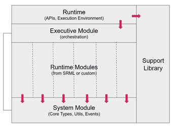

# Substrate FRAME基础功能模块介绍
  

## System
提供了 types,storages,helper functions 等一系列系统运行的基础功能

## Support
提供了开始时常用的宏（#[pallet::event] #[pallet::storage]） macros,traits  

## Executive
runtime的编排层，负责把请求分配到不同的runtime模块，区块的成产

## Pallets
不同的Pallet包含了不同的业务逻辑

client --> 用来实现轻节点和客户端
frame --> 业务逻辑，和帮助实现业务逻辑的组件
primitive --> rust代码编译到WASM自然需要一些interface去访问IO以及网络，或者一些系统调用

### FRAME 模块导读
#### system
#### timestamp
#### transaction-payment
#### utility
#### Balance
#### assets
