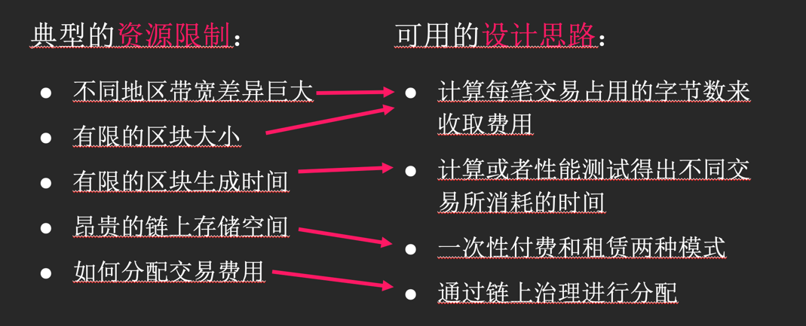

# Transition Weight&Fees（交易费用和权重）
## 交易费用的存在原因
**Web 2.0**中 服务提供方利用用户的个人信息、产生的数据、注意力等来变现： 
   1. 广告推送；
   2. 用户数据分析指导商家决策；
   3. 直接共享、贩卖用户隐私等。
**Web 3.0**中 用户通过私钥掌握数据，敏感数据可以通过加密防止被窃取。享受自由也要支付服务费用，用来： 
      1. 激励参与方更加有效的协作；
      2. 调节资源的利用率

## 设计思路

## 费用组成
总费用 = 基本费用 + 字节费用 + 权重费用 * 动态调节费率 + 小费  

**基本费用**每笔交易所需支付的最少费用
1. ExtrinsicBaseWeight，
2. WeightToFee 将权重转换为费用  

**字节费用** = 每字节费用 * 字节数 
1. 字节数是SCALE编码后的长度 
2. 最大区块长度BlockLength
3. 每字节的费用TransactionByteFee
4. 配置在可升级的runtime代码

        (Kusama网络：5MB，0.0000003ksm)

**权重费用** 权重被用来定义交易产生的计算复杂度
1. 区块的总权重 BlockWeights
2. 不同级别的交易类型 Normal, Operational, Mandatory
3. 可用区块比
4. 每个交易都有一个基本权重 ExtrinsicBaseWeight（基本费用）
5. 数据库读写权重是常量

       (Kusama网络 区块的总权重 2,000,000,000,000 可用区块比：75% Base weight: 86_309 * 1,000)

设置权重费用:
1. 通过 Pays::No 来取消交易费用
2. 权重纠正，可调用函数返回实际权重值
3. WeightToFee 将权重值转换成费用
4. 合理的权重值需要通过性能测试来获取
5. 设置权重的方式：默认形式，自定义的形式
   1. 默认权重
```rust
#默认形式：
// Normal交易
#[weight = 2_000_000]
pub fn accumulate_dummy(origin: OriginFor<T>, increase_by: T::Balance) -> DispatchResult {
// --snip--
}

#[weight = T::DbWeight::get().reads_writes(1, 2) + 20_000]
pub fn accumulate_dummy(origin: OriginFor<T>, increase_by: T::Balance) -> DispatchResult {
// --snip--
}


// Operational交易
#[weight = (2_000_000, DispatchClass::Operational)]
pub fn accumulate_dummy(origin: OriginFor<T>, increase_by: T::Balance) -> DispatchResult {
// --snip--
}

#[weight = (100_000, DispatchClass::Operational, Pays::No)]
pub fn accumulate_dummy(origin: OriginFor<T>, increase_by: T::Balance) -> DispatchResult {
// --snip--
}
```
   2. 自定义权重(自定义权重计算方法，自定义的结构体，并实现接口)
      1. WeighData，计算权重
      2. ClassifyDispatch，判断交易级别
      3. PaysFee，设置是否付费标志位
```rust
/// 先定义一个结构体
struct LenWeight(u32);

/// 实现 WeighData
impl<T: Encode> WeighData<T> for LenWeight {
        /// &self本身，target交易
      fn weigh_data(&self, target: T) -> Weight {
            let multiplier = self.0;
            let encoded_len = target.encode().len() as u32;
            multiplier * encoded_len
      }
}

/// ClassifyDispatch
impl<T: Encode> ClassifyDispatch<T> for LenWeight {
    fn classify_dispatch(&self, target: T) -> DispatchClass {
          let encoded_len = target.encode().len() as u32;
          if encoded_len > 100 {
                DispatchClass::Operational
          } else {
                DispatchClass::Normal
          }
    }
}

/// 实现 PaysFee
impl<T: Encode> PaysFee<T> {
    fn pays_fee(&self, target: T) -> Pays {
          let encoded_len = target.encode().len() as u32;
          if encoded_len > 10 {
                Pays::Yes
          } else {
                Pays::No
          }
    }
}

///使用自定义的权重
#[weight = LenWeight(10)]
pub fn set_dummy(origin: OriginFor<T>, #[compact] new_value: T::Balance) {
  // --snip--
}}

```
  3. 权重费用转换
```rust
pub struct WeightToFee;

impl WeightToFeePolynomial for WeightToFee {
    type Balance = Balance;
    fn polynomial() -> WeightToFeeCoefficients<Self::Balance> {
          // -- snip --
    }
}
   
```

**动态调节费率** 网络平稳运行的过程中，区块资源的使用比例应该稳定  
1. TargetBlockFullness参数，通常为25%
2. 当前区块资源使用超过25%时，提高下一区块动态调节费率，增加交易费用；
3. 当资源使用率不足25%时，降低下一区块的动态调节费率，减少交易费用，鼓励交易的发生

**小费** 不是必须的，具体数量由交易发送者决定，并且完全由区块生产者获得；  
而交易费用的其它组成部分会根据一定的比例分配进入“国库”。

## 资料
**文档：**  
https://docs.substrate.io/main-docs/build/tx-weights-fees/  
https://docs.substrate.io/reference/how-to-guides/weights/calculate-fees/  
https://docs.substrate.io/reference/how-to-guides/weights/add-benchmarks/  
https://docs.substrate.io/main-docs/test/benchmark/  
https://substrate.dev/docs/en/knowledgebase/learn-substrate/weight  
https://substrate.dev/docs/en/knowledgebase/runtime/benchmarking  
**代码：**  
https://github.com/paritytech/substrate/tree/master/frame/example
https://github.com/kaichaosun/play-substrate/blob/master/pallets/poe/src/benchmarking.rs

